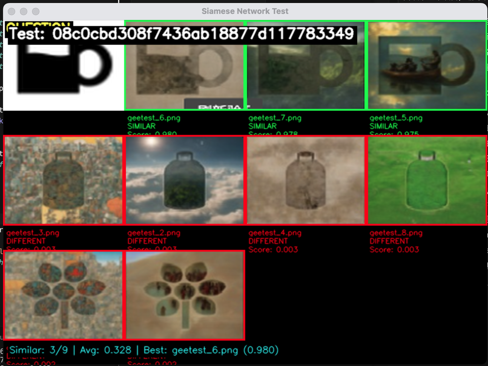
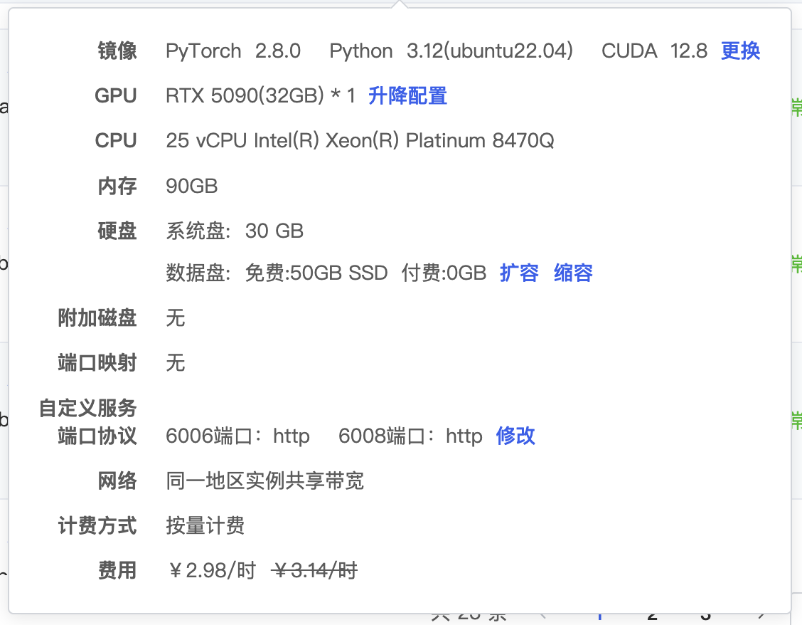
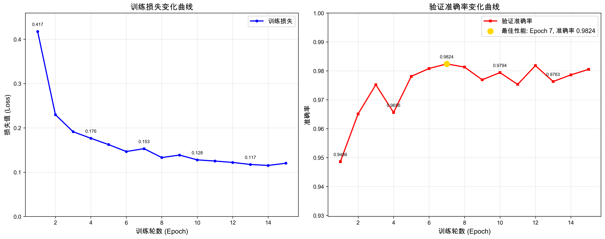

# Gemini自标注与孪生网络驱动的九宫格验证码识别

## 项目介绍

​	我们在使用传统方案进行九宫格验证码识别往往存在数据采集难、数据标注耗时耗力、训练慢等问题，本项目采用Playwright实现数据集自动化采集、依赖于Gemini 2.5 Pro多模态大模型实现的数据集自动标注、基于ResNet-18实现的孪生神经网络，实现了一套完全由自动化驱动的九宫格类验证码识别解决方案。




## 项目结构

```
project/
├── README.md                             # 项目说明文档
├── annotation.py                         # 自动标注脚本
├── best_siamese_model.pth                # 模型文件
├── plot_training.py                      # 训练日志转可视化图
├── remove_fail_data.py                   # 处理错误标注的数据脚本
├── requirements.txt                      # 依赖
├── siamese_network.py                    # 神经网络结构
├── spider_geetest.py                     # 数据集爬虫
├── test.py                               # 推理测试
├── train.py                              # 训练脚本
└── visual_test.py                        # 可视化测试

```


## 工作流程


## 环境要求

### 系统要求
- Python 3.9+
- 支持CUDA的GPU (推荐) 或 Apple Silicon MPS

### 核心依赖
```bash
torch
torchvision
requests
Pillow
python-dotenv
playwright
opencv-python
numpy
```


## 快速开始

### 1. 环境安装

```bash
# 克隆项目
git clone https://github.com/u-wlkjyy/siam-autolabel.git
cd siam-autolabel

# 安装依赖
pip install -r requirements.txt

# 安装playwright浏览器驱动
playwright install
```


### 2. 环境变量配置

创建`.env`文件并配置AI服务：

```bash
API_KEY=your_gemini_api_key
BASE_URL=gemini_api_server
```


### 3. 数据采集 

```bash
python spider_geetest.py
```

如果希望采集一些测试数据，可以修改代码中output_path位置为``./tests``目录即可

```python
output_path = './tests'
```

**说明:**

- 工作线程数: 16个并发线程
- 目标网站: https://account.siliconflow.cn/zh/login
- 输出目录: `./output/`
- 每个样本包含: `full.png`(完整验证码图片) + `question.png`(问题图片) + `geetest_0.png` 到 `geetest_8.png`(九宫格候选图片)


### 4. 数据自动标注 (可选)

对采集的数据进行AI自动标注：

```bash
python annotation.py
```

标注完成后清理标注有误的数据

```bash
python remove_fail_data.py
```


### 5. 模型训练

```bash
python train.py --epochs 1000 --batch_size 32 --lr 0.001
```

在**macOS**下训练将**cpu**修改为**mps**可获得较大的性能提升

```python
# 检查CUDA可用性
device = torch.device('cuda' if torch.cuda.is_available() else 'mps')
```


**训练参数说明:**

- `--dataset_path`: 数据集路径 (默认: `./dataset`)
- `--batch_size`: 批次大小 (默认: 32)
- `--epochs`: 训练轮数 (默认: 1000)
- `--lr`: 学习率 (默认: 0.001)
- `--feature_dim`: 特征维度 (默认: 512)


### 6. 可视化测试

模型训练完成后，将训练的模型文件拖到项目目录上，运行下面命令可以可视化显示模型性能。

```bash
python visual_test.py
```

**操作说明:**

- `空格键`: 下一个测试样本
- `p键`: 上一个测试样本
- `s键`: 保存当前结果图片
- `q键`: 退出测试


## 模型架构

### 孪生神经网络结构

```
输入图片对 (224x224x3)
       ↓
ResNet-18特征提取器 (共享权重)
       ↓
特征向量 (512维)
       ↓
L2归一化
       ↓
特征连接 + 相似度计算
       ↓
输出相似度分数 (0-1)
```

### 损失函数

- **BCE损失**: 二分类交叉熵损失
- **对比损失**: 基于欧氏距离的对比学习损失
- **组合损失**: `总损失 = BCE损失 + 0.5 × 对比损失`


## 数据集说明

### 数据结构
```
样本目录/
├── question.png           # 问题图片 (验证码指令)
├── geetest_0.png         # 负样本1
├── geetest_1.png         # 负样本2
├── ...                   # ...
├── geetest_8.png         # 负样本9
├── geetest_answer_1.png  # 正样本1
└── geetest_answer_2.png  # 正样本2
```


## 使用示例

### 单张图片预测

建议使用批量预测，取前三个相似的图片作为结果可保证最佳性能！

```python
from siamese_network import SiameseNetwork, get_transforms, predict_similarity
import torch

# 加载模型
device = torch.device('cuda' if torch.cuda.is_available() else 'cpu')
model = SiameseNetwork(feature_dim=512).to(device)
model.load_state_dict(torch.load('best_siamese_model.pth', map_location=device))

# 获取数据变换
_, transform = get_transforms()

# 预测相似度
result = predict_similarity(
    model=model,
    img1_path='question.png',
    img2_path='candidate.png', # 选项图片
    transform=transform,
    device=device
)

print(f"相似度分数: {result['similarity_score']:.3f}")
print(f"是否相似: {result['is_similar']}")
```


### 批量预测

```python
import glob
import os

test_dir = './tests/sample_folder'
question_path = os.path.join(test_dir, 'question.png')
candidates = sorted(glob.glob(os.path.join(test_dir, 'geetest_*.png')))

results = []
for candidate in candidates:
    result = predict_similarity(model, question_path, candidate, transform, device)
    results.append({
        'file': candidate,
        'similarity': result['similarity_score'],
        'is_match': result['is_similar']
    })

# 按相似度排序
results.sort(key=lambda x: x['similarity'], reverse=True)
print("预测结果 (按相似度排序):")
for r in results[:3]:  # 显示前3个最相似的
    print(f"{os.path.basename(r['file'])}: {r['similarity']:.3f}")
```


## 性能指标

你可能会提出“**需要训练多久呀？**”、“**准确率能达到多少？**”等等一些列问题，在这里做统一的解答。

在这里我使用了默认配置，在AutoDL平台中使用了``RTX Geforce 5090 32GB``进行训练做出的数据统计，具体配置可以参考下图。




以下是训练15分钟的日志

```bash
模型总参数数: 11,997,249
可训练参数数: 11,997,249
开始训练...
Epoch 1/1000 |████████████████████████████████████████| 993/993 [100.0%] loss: 0.4175 ETA: 00:00 19.8it/s
Validating...
Epoch 1/1000: train_loss=0.4175 val_acc=0.9486 lr=0.001000 time=56.0s
🏆 New best model saved! Val Acc: 0.9486
--------------------------------------------------------------------------------
Epoch 2/1000 |████████████████████████████████████████| 993/993 [100.0%] loss: 0.2298 ETA: 00:00 21.5it/s
Validating...
Epoch 2/1000: train_loss=0.2298 val_acc=0.9651 lr=0.001000 time=52.2s
🏆 New best model saved! Val Acc: 0.9651
--------------------------------------------------------------------------------
Epoch 3/1000 |████████████████████████████████████████| 993/993 [100.0%] loss: 0.1913 ETA: 00:00 21.2it/s
Validating...
Epoch 3/1000: train_loss=0.1913 val_acc=0.9752 lr=0.001000 time=52.4s
🏆 New best model saved! Val Acc: 0.9752
--------------------------------------------------------------------------------
Epoch 4/1000 |████████████████████████████████████████| 993/993 [100.0%] loss: 0.1765 ETA: 00:00 21.6it/s
Validating...
Epoch 4/1000: train_loss=0.1765 val_acc=0.9656 lr=0.001000 time=51.6s
--------------------------------------------------------------------------------
Epoch 5/1000 |████████████████████████████████████████| 993/993 [100.0%] loss: 0.1623 ETA: 00:00 20.9it/s
Validating...
Epoch 5/1000: train_loss=0.1623 val_acc=0.9781 lr=0.001000 time=54.0s
🏆 New best model saved! Val Acc: 0.9781
--------------------------------------------------------------------------------
Epoch 6/1000 |████████████████████████████████████████| 993/993 [100.0%] loss: 0.1466 ETA: 00:00 21.5it/s
Validating...
Epoch 6/1000: train_loss=0.1466 val_acc=0.9808 lr=0.001000 time=51.8s
🏆 New best model saved! Val Acc: 0.9808
--------------------------------------------------------------------------------
Epoch 7/1000 |████████████████████████████████████████| 993/993 [100.0%] loss: 0.1531 ETA: 00:00 21.7it/s
Validating...
Epoch 7/1000: train_loss=0.1531 val_acc=0.9824 lr=0.001000 time=51.4s
🏆 New best model saved! Val Acc: 0.9824
--------------------------------------------------------------------------------
Epoch 8/1000 |████████████████████████████████████████| 993/993 [100.0%] loss: 0.1330 ETA: 00:00 21.1it/s
Validating...
Epoch 8/1000: train_loss=0.1330 val_acc=0.9813 lr=0.001000 time=53.0s
--------------------------------------------------------------------------------
Epoch 9/1000 |████████████████████████████████████████| 993/993 [100.0%] loss: 0.1386 ETA: 00:00 21.5it/s
Validating...
Epoch 9/1000: train_loss=0.1386 val_acc=0.9769 lr=0.001000 time=51.7s
--------------------------------------------------------------------------------
Epoch 10/1000 |████████████████████████████████████████| 993/993 [100.0%] loss: 0.1278 ETA: 00:00 21.4it/s
Validating...
Epoch 10/1000: train_loss=0.1278 val_acc=0.9794 lr=0.001000 time=52.1s
--------------------------------------------------------------------------------
Epoch 11/1000 |████████████████████████████████████████| 993/993 [100.0%] loss: 0.1251 ETA: 00:00 20.9it/s
Validating...
Epoch 11/1000: train_loss=0.1251 val_acc=0.9753 lr=0.001000 time=53.2s
--------------------------------------------------------------------------------
Epoch 12/1000 |████████████████████████████████████████| 993/993 [100.0%] loss: 0.1220 ETA: 00:00 21.6it/s
Validating...
Epoch 12/1000: train_loss=0.1220 val_acc=0.9818 lr=0.001000 time=51.6s
--------------------------------------------------------------------------------
Epoch 13/1000 |████████████████████████████████████████| 993/993 [100.0%] loss: 0.1174 ETA: 00:00 20.4it/s
Validating...
Epoch 13/1000: train_loss=0.1174 val_acc=0.9763 lr=0.001000 time=54.4s
--------------------------------------------------------------------------------
Epoch 14/1000 |████████████████████████████████████████| 993/993 [100.0%] loss: 0.1152 ETA: 00:00 21.1it/s
Validating...
Epoch 14/1000: train_loss=0.1152 val_acc=0.9786 lr=0.001000 time=52.8s
--------------------------------------------------------------------------------
Epoch 15/1000 |████████████████████████████████████████| 993/993 [100.0%] loss: 0.1202 ETA: 00:00 20.3it/s
Validating...
Epoch 15/1000: train_loss=0.1202 val_acc=0.9805 lr=0.001000 time=54.5s
```

经过测试，在第7个Epoch时能达到最好的性能效果，精度达到**0.9824**，在后续训练中基本上跑不动了，用时约5分钟。

```bash
Epoch 7/1000 |████████████████████████████████████████| 993/993 [100.0%] loss: 0.1531 ETA: 00:00 21.7it/s
Validating...
Epoch 7/1000: train_loss=0.1531 val_acc=0.9824 lr=0.001000 time=51.4s
🏆 New best model saved! Val Acc: 0.9824
```

曲线图如下：




## 免责声明

本项目仅供学术研究和技术交流使用，核心目的是探索多模态大模型在自动化图像标注领域的应用，以及孪生神经网络在特定识别任务中的实现。 

**严禁**将本项目的任何部分（包括代码、模型、数据集等）用于以下目的： 

1. 任何形式的商业用途或盈利活动。 
2. 对任何网站或系统进行大规模、未授权的爬取、抓取或攻击。 
3. 破解、绕过任何形式的验证码或安全防护措施。 
4. 任何违反相关法律法规或侵犯第三方合法权益的行为。


使用者在使用本项目时，必须充分理解并同意：

* 本项目的作者和贡献者**不承担**因使用者滥用、不当使用或违反本声明而导致的任何直接或间接责任、风险或损失。 
* 使用者需自行承担所有因使用本项目而产生的后果和法律责任。 


如果您下载、安装、使用或分发本项目，即代表您已充分阅读、理解并接受本声明的所有条款。


## 致谢

本项目使用 [PyCharm](https://www.jetbrains.com/pycharm/) 开发，感谢 [JetBrains](https://www.jetbrains.com/) 公司为学生提供的免费许可证。

- 感谢 [@七彩云资源网](http://www.qicaiy.cn) 为本项目提供自动化数据标注提供了Gemini API

  